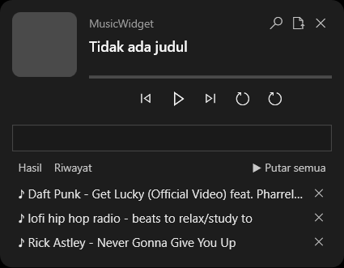

<div align="center">


# 🎵 Simple Music Widget

**A tiny, futuristic now-playing overlay for Windows.**
One widget controls *everything* — YouTube & Spotify in your browser, VLC, Windows Media Player, and more.


</div>

---

## ✨ Why this widget?

Most "now playing" widgets only work with one app. This one reads Windows **System Media Transport Controls (SMTC)** — the same layer the OS uses for its taskbar media flyout — so it shows and controls **whatever you're playing**, from any app, with a single tiny window. It also adds its own **built-in YouTube audio player** (search & play without opening a browser).

- 🪶 **Lightweight** — ~85 MB working set, single small `.exe`, no heavy frameworks.
- 🎛️ **Universal control** — prev / play-pause / next + live progress bar for any source.
- 🔎 **YouTube search & play (audio only)** — no browser needed.
- 🕘 **History** — past searches autocomplete; played tracks are saved and replayable.
- ▶️ **Play all** — queue an entire result list or your history (auto-advances).
- 🔁 **Repeat & Loop** — replay the last track, or loop the current one forever.
- 🗑️ **One-tap delete** — remove any history item with its little ✕.
- 🚀 **Auto-start + auto-show** — runs at boot, appears only when music plays.
- 🔔 **Auto-update** — keeps `yt-dlp` fresh and notifies on new app releases.

---

## 📸 Screenshots

| YouTube search & results | Play history (replay / delete / play-all) |
|---|---|
|  |  |

---

## ▶️ Demo (how it works)

1. **Play music anywhere** — YouTube in Chrome/Edge, Spotify, VLC, Windows Media Player. The widget pops up at the bottom-right with the title, artist, artwork, and working controls.
2. **Search YouTube** — click 🔎, type a song, press Enter. Pick a result to play its audio right inside the widget (no browser).
3. **Play all** — hit **▶ Putar semua** to queue the whole list; it auto-advances track to track.
4. **History** — open the search box: empty shows recently **played** tracks (click to replay); typing shows matching **past searches** (autocomplete). Switch tabs with **Hasil** / **Riwayat**.
5. **Repeat / Loop** — 🔁 replays the last track; the loop button repeats the current track endlessly.
6. **Delete** — click the small ✕ on any history row to remove it.

---

## 🚀 Install (Windows)

**Requirements:** Windows 10/11 + [.NET 8 Desktop Runtime](https://dotnet.microsoft.com/download/dotnet/8.0). For the YouTube feature: `yt-dlp` + `ffmpeg`.

```powershell
winget install Microsoft.DotNet.SDK.8        # to build
winget install yt-dlp.yt-dlp Gyan.FFmpeg     # for YouTube audio
```

### One-click setup

```powershell
git clone https://github.com/Wayan123/Simple-Music-Widget.git
cd Simple-Music-Widget
powershell -ExecutionPolicy Bypass -File install.ps1
```

`install.ps1` builds the app, adds a **Startup** shortcut (auto-run at boot), a **Start Menu** shortcut (right-click → *Pin to taskbar*), and launches it.

### Or just run

```powershell
dotnet run -c Release
```

Prefer a prebuilt binary? Grab the ZIP from [**Releases**](https://github.com/Wayan123/Simple-Music-Widget/releases/latest).

---

## 🧠 How it stays "one widget for all"

It does **not** talk to YouTube/Spotify directly for control. It reads **SMTC** (`Windows.Media.Control.GlobalSystemMediaTransportControlsSessionManager`), the central layer every modern media app reports to. For its own YouTube player, `yt-dlp` resolves the audio stream and `ffmpeg` bridges it into a local file that WPF `MediaPlayer` plays (WPF can't open googlevideo URLs directly).

> ⚠️ Playing YouTube audio outside a browser is against YouTube's ToS and can break when YouTube changes. `yt-dlp` is auto-updated to reduce breakage.

---

## 🗂️ Project structure

| File | Role |
|------|------|
| `MediaService.cs` | SMTC wrapper: read active session, snapshot, prev/play/next |
| `LocalPlayer.cs` | MediaPlayer for local files & YouTube (ffmpeg bridge), loop, queue events |
| `YouTubeService.cs` | yt-dlp search + audio-URL resolve; yt-dlp/ffmpeg path resolve |
| `HistoryStore.cs` | JSON persistence for searches & played tracks |
| `UpdateService.cs` | GitHub Releases version checker |
| `TrayIcon.cs` | System-tray icon (show / exit) |
| `App.xaml.cs` | Single-instance entry point (summons running instance) |
| `MainWindow.xaml(.cs)` | UI overlay, search/history, queue, repeat/loop, auto show-hide |
| `install.ps1` | Publish + Startup/Start-Menu shortcuts + yt-dlp update |
| `make_icon.py` | Generates the futuristic 3D icon |

---

## 📦 Releasing a new version (maintainer)

1. Bump `<Version>` in `MusicWidget.csproj`.
2. Tag, publish, and release:
   ```powershell
   git tag -a v1.1.0 -m "v1.1.0"; git push origin v1.1.0
   dotnet publish -c Release -o publish
   Compress-Archive publish\* MusicWidget-v1.1.0-win-x64.zip
   gh release create v1.1.0 MusicWidget-v1.1.0-win-x64.zip --title "v1.1.0"
   ```
3. Running widgets detect the new release and show a tray notification.

---

## 🐧 Linux?

Not yet. The widget is built on Windows-only tech (SMTC + WPF). A Linux version would need a separate app (MPRIS/D-Bus + GTK/Qt) and is planned as a future, separate project.

---

## 📄 License

MIT — free to use, modify, and share.
